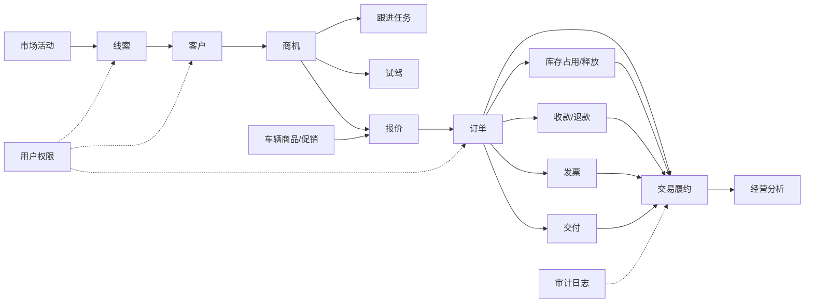

# 核心业务不变量治理方案

## 关联 Spec

- docs/spec/用户权限/01-流程规则与验收规格.md
- docs/spec/线索管理/01-流程规则与验收规格.md
- docs/spec/客户管理/01-流程规则与验收规格.md
- docs/spec/车辆商品/01-流程规则与验收规格.md
- docs/spec/促销政策/01-流程规则与验收规格.md
- docs/spec/报价订单/01-流程规则与验收规格.md
- docs/spec/交易履约/01-流程规则与验收规格.md
- docs/spec/库存管理/01-流程规则与验收规格.md
- docs/spec/发票管理/01-流程规则与验收规格.md
- docs/spec/收款退款/01-流程规则与验收规格.md
- docs/spec/数据字典/01-流程规则与验收规格.md
- docs/spec/市场活动/01-流程规则与验收规格.md
- docs/spec/经营分析/01-流程规则与验收规格.md

## 背景

当前系统的主要风险不在单个页面或单个接口，而在业务对象组合后缺少统一规则。权限、状态、金额、库存、删除和统计分别存在局部实现，但没有共同保证以下事实：

- 有权处理的人能看到并处理对应业务。
- 无权处理的人不能通过参数绕过范围。
- 商品、促销、报价、交易、库存、发票和收款使用同一套状态与金额口径。
- 删除、停用和关闭不会破坏历史。
- 统计数字能回到明细反算。

## 目标

- 恢复销售创建交易、主管审批、财务开票收款、交易完成的业务闭环。
- 建立稳定业务编码，禁止展示文案进入数据库和接口业务值。
- 建立交易客户归属、商品可售、促销计算、库存占用和金额重算的统一规则。
- 建立基础资料删除保护，避免字典、线索、商品、活动和交易删除产生孤儿历史。
- 建立生产、测试和本地数据库结构一致的校验要求。
- 建立可覆盖真实前后端契约的核心链路验证。

## 当前现状

- 后端数据范围主要由 `DataScopeAspect` 和 `CurrentUserProvider` 注入查询条件，当前角色差异不足以支撑主管审批和财务处理销售交易。
- 交易创建逻辑集中在 `TranServiceImpl.createTransaction`，当前主要校验商品，不足以约束客户访问范围。
- 交易商品写入逻辑集中在 `TranServiceImpl.addTransactionProducts`，存在增量语义与总金额重算口径需要统一的问题。
- 发票、收款、审批和库存释放集中在 `TranServiceImpl` 多个方法内，交易阶段、发票状态、支付状态和库存变动需要统一事务边界。
- 商品状态由后端和数据库使用稳定编码，前端页面存在展示文案与业务编码混用风险。
- 促销类型和值域由前后端分别维护，服务端校验和页面文案需要统一。
- 字典、线索、商品和活动删除逻辑需要统一引用检查，不能为删除配置而删除业务历史。
- 生产初始化脚本和测试 schema 约束不一致，导致测试无法代表生产行为。

## 业务对象关系图

业务对象关系图只表达业务事实依赖。收款、发票、库存和交付围绕订单并行推进，不能被交易履约压缩成一个单一状态。

## 状态事件矩阵

| 业务事件 | 触发对象 | 主要影响对象 | 必须检查 | 失败后状态 |
| --- | --- | --- | --- | --- |
| 线索转客户 | 线索 | 客户、线索历史 | 查重、负责人、数据范围 | 线索保持原状态并记录失败原因 |
| 商机创建 | 客户 | 商机、客户视图 | 客户存在、客户可访问、购车需求 | 不创建商机 |
| 试驾完成 | 试驾 | 商机、跟进任务 | 安全确认、车辆可用、反馈结果 | 试驾异常或取消 |
| 报价提交 | 商机 | 报价、审批 | 客户、商品、促销、价格权限 | 报价草稿或驳回 |
| 报价审批 | 报价 | 报价版本、审计 | 审批人、价格规则、自建自批 | 审批驳回 |
| 客户确认 | 报价 | 订单 | 报价有效、客户确认、库存可用 | 报价保持待确认或过期 |
| 订单成立 | 报价/客户 | 订单、履约、库存、收款计划 | 客户、车辆、价格、付款、交付预期 | 不创建订单 |
| 库存占用 | 订单 | 库存、履约 | 可售库存、重复占用、锁定条件 | 库存不足或占用失败 |
| 收款确认 | 订单 | 收款、履约 | 幂等号、金额、财务权限 | 待确认或退回 |
| 发票开具 | 订单 | 发票、履约 | 抬头、金额、订单状态 | 开票失败 |
| 交付完成 | 订单 | 交付、库存、履约 | 资金、票据、资料、车辆、签收 | 交付异常 |
| 交易完成 | 履约 | 履约、经营分析 | 订单、资金、票据、库存、交付全部满足 | 保持进行中并暴露阻塞点 |
| 订单取消 | 订单 | 履约、库存、收款、发票、商机 | 当前状态、已收款、已开票、已交付 | 进入异常处理 |

## 跨模块依赖顺序

1. 先建立用户权限、数据范围和业务负责人规则。
2. 再统一车辆商品、促销、报价和客户访问契约。
3. 再处理订单成立、库存占用、收款、发票和交付的并行履约。
4. 再补齐异常取消、引用保护、历史保留和 DDL 一致性。
5. 最后以经营分析和集成验收反算业务链路是否可信。

## 业务场景验收矩阵

| 场景 | 关联模块 | 通过标准 |
| --- | --- | --- |
| 线索转客户但不生成交易 | 线索、客户、审计 | 客户创建成功，线索历史保留，无订单、收款、发票、交付记录被创建 |
| 客户产生多个商机 | 客户、商机、跟进 | 客户视图能看到多个商机，各商机阶段独立 |
| 商机试驾后进入报价 | 商机、试驾、报价 | 试驾结果可追溯，报价版本从商机产生，不自动成交 |
| 报价审批后客户确认订单 | 报价、订单、权限 | 审批人非创建人，订单锁定成交快照 |
| 订单成立后库存占用 | 订单、库存、履约 | 库存占用写流水，订单履约显示库存阻塞点 |
| 收款、发票、交付并行推进 | 收款、发票、交付、履约 | 三类状态独立可见，任一未完成时交易不完成 |
| 发票作废和退款 | 发票、收款、履约 | 原发票和原收款保留，作废/退款产生新事实 |
| 订单取消释放库存 | 订单、库存、收款、发票 | 库存释放、退款待处理、票据异常均可追溯 |
| 交易完成反算 | 履约、经营分析 | 完成交易能反查订单、资金、票据、库存和交付证据 |
| 普通用户统计下钻 | 经营分析、权限 | 指标与明细使用同一数据范围 |

## 设计方案

### 权限与数据范围

- 固定当前阶段角色数据范围，不依赖尚未建立的组织架构页面。
- 销售顾问只处理自己负责的客户、线索、报价和交易。
- 销售经理能处理团队范围内待审批报价和交易。
- 财务人员能处理进入财务阶段的交易、发票、收款和退款。
- 管理员可处理全局数据，但不能作为自建自批的豁免条件。
- 交易审批必须检查审批人与创建人不同。
- 用户角色分配、禁用和锁定必须共同保护最后一个可用管理员。

### 商品、促销与报价契约

- 接口和数据库只保存稳定业务编码，页面只做展示映射。
- 商品状态保存为可售、停售等稳定编码；前端不得提交中文显示值。
- 促销类型只保留当前系统可结算的类型，百分比折扣和值域由服务端校验。
- 新报价只能引用真实存在、当前可售、当前操作者有权使用的商品和客户。
- 报价行和订单行保留成交时商品、促销和价格快照。
- 商品增删改不得破坏历史订单和库存流水。

### 交易、发票、收款与库存闭环

- 交易完成条件由收款、发票和交付共同决定。
- 采用先开票后收款时，发票正式开具后才允许进入待收款或可完成收款阶段。
- 库存占用发生在订单成立或明确锁车动作，不在报价创建时永久扣减。
- 所有库存变化通过统一入口完成库存数字更新和库存流水写入。
- 支付参考号具备幂等判断，每笔成功收款都写审计。
- 交易商品金额按全部有效行项重算。

### 基础资料与历史保护

- 已转客户线索、已被引用商品、已产生业务结果的活动、被业务引用字典值不得物理删除。
- 字典删除只允许删除未使用草稿值；历史值应停用或保留。
- 客户、线索、活动、商品删除前必须执行完整引用检查。
- 线索转客户后，客户和后续首个交易对象继承同一业务归属。
- 客户跟进记录补齐可维护入口，保证线索转客户后的沟通链不断裂。

### 数据库结构一致性

- 确定唯一 DDL 来源。
- 生产、测试和本地初始化不能维护含义不同的结构。
- 唯一约束、外键约束、删除行为和索引必须在所有环境一致。
- 迁移脚本必须覆盖线索手机号唯一、客户到线索、交易到客户、交易历史到交易、交易商品、发票和支付等核心关系。

### 统计口径

- 成交金额只统计完成交易。
- 商机金额或在途交易金额单独命名和展示。
- 交易数按交易记录统计，成交客户数按完成交易去重客户统计。
- 普通用户统计与明细必须使用同一数据范围。
- 指标必须能从明细反算，不能展示无法解释的全局数字。

## 风险与约束

- 不能为了修复测试而降低业务断言。
- 不能通过前端过滤替代服务端权限、状态和金额校验。
- 不能通过物理删除历史记录来解决配置删除。
- 不能让商品编辑路径直接覆盖库存数量。
- 不能让报价状态直接代表收款、发票或交付状态。
- 不能在没有迁移方案时直接破坏历史数据。

## 实施阶段

1. 固定角色数据范围、交易自建自批限制、最后管理员保护和负责人候选过滤。
2. 统一商品状态、促销类型、折扣值域、交易客户校验和在售商品选择。
3. 重构交易阶段、发票状态、收款幂等、库存占用释放和交易金额重算。
4. 补齐线索、客户、字典、商品和活动的删除保护与历史保留。
5. 统一生产、测试和本地 DDL，补齐必要约束和迁移说明。
6. 重定义经营指标口径，补齐核心链路集成验证。

## 任务拆分

- docs/task/核心业务闭环/00-任务拆分总览.md
- docs/task/核心业务闭环/01-权限数据范围与交易审批闭环任务.md
- docs/task/核心业务闭环/02-商品促销与报价契约任务.md
- docs/task/核心业务闭环/03-交易发票收款库存闭环任务.md
- docs/task/核心业务闭环/04-线索客户活动历史保护任务.md
- docs/task/核心业务闭环/05-字典删除与DDL一致性任务.md
- docs/task/核心业务闭环/06-统计口径与闭环验证任务.md

## 验收标准

- 销售创建交易后，主管可见并能审批，财务可见并能处理发票和收款。
- 交易创建人不能审批自己的交易。
- 页面新增可售商品后，该商品能进入报价或订单候选。
- 折扣、直减和商品金额在前端展示、后端计算和订单快照中一致。
- 非本人客户 ID 不能通过伪造请求绑定到交易。
- 线索清空字段、客户分页、已转客户线索保护和活动引用保护符合业务预期。
- 发票、收款、交付条件不满足时，交易不能错误完成。
- 库存数字和库存流水能逐笔核对。
- 字典删除不会删除业务备注或历史记录。
- 生产、测试和本地结构约束一致。
- 成交金额、交易数、成交客户数和转化率能通过明细反算。
